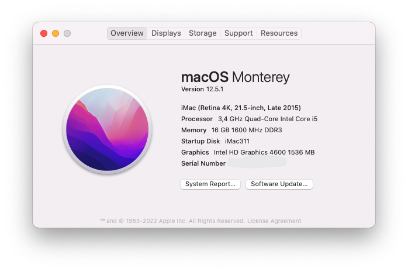

# iMac311
Hackintosh, used as a secondary workstation. A work in progress...

Guide used: https://dortania.github.io/OpenCore-Install-Guide/prerequisites.html#getting-started-with-opencore

***

## Hardware

- CPU: Intel Core I5-4670
- GPU: HD Graphics 4600 (internal)
- RAM: Corsair Vengeance DDR3 16GB (2 x 8GB) 1600MHz
- Motherboard: ASUS H81M-E
- Audio codec: ALC887 (onboard)
- Ethernet: RTL8111G Gigabit LAN Controller (onboard)
- WiFi/BT: fenvi T919 PCI-E WiFi Adapter (BCM94360CD)
- SSD: Sandisk SSD Plus 480GB
- CPU Cooler: Intel Stock
- Chassis: Generic
- Case fan: Noctua NF-A8 PWM
- PSU:

***

## Software

- BIOS: 3602
- Boot loader: Opencore 0.7.7
- Operating system: macOS Monterey 12.4

### Tools

- MountEFI: https://github.com/corpnewt/MountEFI
- ProperTree: https://github.com/corpnewt/ProperTree
- USBMap: https://github.com/corpnewt/USBMap
- GenSMBIOS: https://github.com/corpnewt/GenSMBIOS
- OCConfigCompare: https://github.com/corpnewt/OCConfigCompare
- Hackintool: https://github.com/headkaze/Hackintool

***

## ACPI

- SSDT-EC-USBX.aml
- SSDT-EC.aml
- SSDT-PLUG.aml

***

## Kexts

### Generic

- Lilu.kext
- VirtualSMC.kext
- WhateverGreen.kext
- AppleALC.kext
- RealtekRTL8111.kext
- SMCProcessor.kext
- SMCSuperIO.kext
- USBInjectAll.kext (only to generate USBPorts.kext)
- CPUFriend.kext
- CPUFriendDataProvider.kext

### System specific

- SMBIOS iMac16,2
- USBPorts.kext

### USB Port Mapping

- All ports are mapped

***

## Working

- Ethernet
- WiFi & Bluetooth
- Audio: Auto switching between speakers and headphones is not working yet. Front mic does not work yet, just use the one at the back.
- Graphics acceleration
- Messages
- Facetime (audio only, don't have a web cam)
- The VGA Port in the back of the motherboard won't work, just use the DVI port with a DVI-D to VGA converter to connect the monitor, if needed.
- Continuity: 
	- AirDrop
	- Continuity Camera
	- Continuity Sketch
	- Continuity Markup
	- Handoff
	- Instant Hotspot
	- iPhone Cellular Calls
	- Text Message Forwarding
	- Universal Clipboard
	- Untested but should work just fine:
		- Apple Pay (N/A)
		- Auto Unlock (don't have an Apple Watch)
		- Sidecar (my iPad is too old)

***

## To do

- 

***

## Acknowledgment

A big thank you to those who spend time coding, documenting or testing these tools. Their effort is really appreciated...
